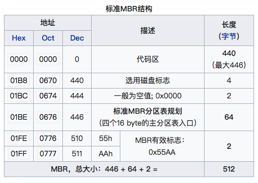
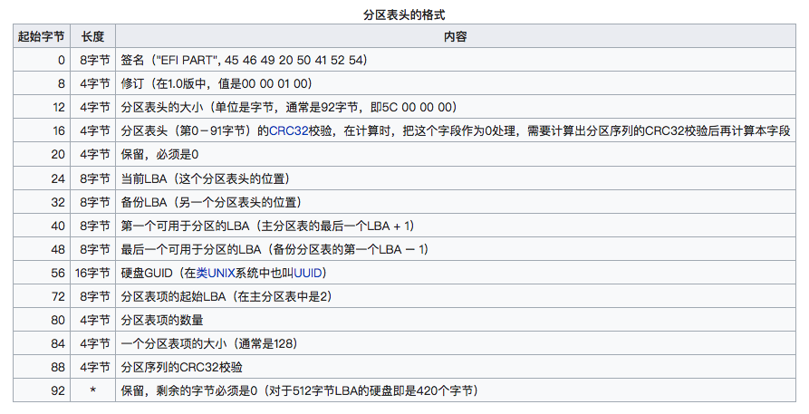
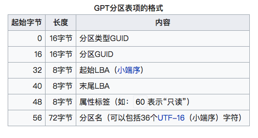

关于磁盘的几个概念

<!-- more -->

# 概念

| LBA       | 一个磁盘逻辑扇区即512B                                       |
| --------- | ------------------------------------------------------------ |
| MBR       | 主引导记录  Master Boot Record 位于磁盘的LBA0，第一个扇区。  |
| MBR分区表 | 记录每个分区的位置和大小， MBR里的分区表只能记录4个主分区。分区和卷是同义 |


# MBR

MBR磁盘第一个扇区(每一个扇区长512B)。MBR包含：
1. 446B 的引导代码，有时候这部分也被称为主引导记录
2. 64B 的分区表
3. 2B 的结束代码 55AA



MBR分区表下系统启动过程：

1. 打开机器电源，BIOS自检，BIOS根据COMS里的设置选择启动磁盘
2. BIOS复制启动磁盘MBR到内存
3. MBR的引导代码指向DPT中标记为活动的分区里的分区引导记录PBR
4. PBR在分区中找到操作系统的引导程序
5. 系统被引导

在MBR类型分区表中，每个分区用16B去记录分区类型，起始扇区，总扇区数(4B)，最多有4个分区项

## 启动代码

主要作用是检查分区表是否正确并且在系统硬件完成自检以后将控制权交给硬盘上的引导程序（如GNU GRUB）。

它不依赖任何操作系统，而且启动代码也是可以改变的，从而能够实现多系统引导。

## 分区表

硬盘分区表占据主引导扇区的64个字节（偏移01BEH--偏移01FDH），可以对四个分区的信息进行描述，其中每个分区的信息占据16个字节。比如某一分区在硬盘分区表的信息如下：
```80 01 01 00 0B FE BF FC 3F 00 00 00 7E 86 BB 00```
1. 第一个字节表示是否激活，80表示活动分区，00表示非活动，其他数值无意义
2. 接下来3个字节表示分区开始位置，"01 01 00" 表示分区开始的磁头号为1，开始的扇区号为1，开始的柱面号为0
3. 接下来一个字节是文件系统类型，0B表示FAT32，其他的07表示NTFS
4. 接下来表示分区结束位置，"3F 00 00 00"表示首扇区的相对扇区号为63；"7E 86 BB 00"表示总扇区数为12289662

## 结束标志

最后两个字节是55，表示主引导记录有效

# GPT

GPT是指GUID Partition Table，是GUID类型磁盘使用的分区表


## LBA0

GUID磁盘的第一个扇区LBA0保存着一个protect MBR，只包含着一个特殊分区类型和结束代码。当操作系统检查到这个 Protect MBR后是会直接忽略掉的。

之所以叫保护MBR，是因为用来防止不支持GPT的硬盘管理工具错误识别并破坏硬盘中的数据。在这个MBR中LBA0个标识为0xEE的分区，以此来表示这块硬盘使用GPT分区表。

在使用MBR/GPT混合分区表的硬盘中，这部分存储了GPT分区表的一部分分区（通常是前四个分区），可以使不支持从GPT启动的操作系统从这个MBR启动，启动后只能操作MBR分区表中的分区。如Boot Camp就是使用这种方式启动Windows。

## 分区表头 LBA1

GUID磁盘的第二个扇区LBA1保存着GPT的头部，分区表头记录了

1. 磁盘的可用空间，以及组成分区表的项(大小和数量)
2. 磁盘的GUID，分区表头部本身的大小和位置(总在LBA1开始)，以及备份分区表头的位置大小
3. 存储本身和分区表的CRC32校验，如果出错从备份恢复，如果备份也错误将不可用



## 分区表项 LBA2 --33

